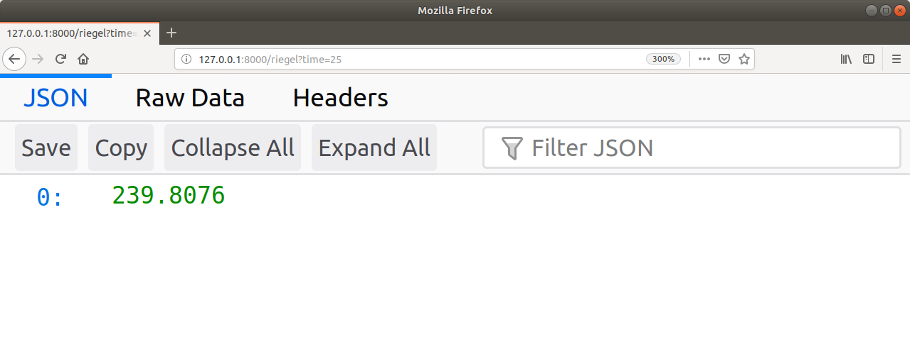

class: bottom, center, image
background-image: url(fig/insomnia.jpg)
background-size: 100%

```{r setup, include=FALSE}
options(htmltools.dir.version = FALSE)

knitr::opts_chunk$set(echo = TRUE,
                      comment = NA,
                      fig.height=4.5,
                      fig.width=12,
                      fig.retina=2,
                      fig.align='center')

library(knitr)
```

???

Data Scientists have weigthy concerns which keep us up at night. We worry about issues like...

---
class: title-slide-section-grey, middle

# Feature selection or penalised regression?

???

Should I use feature selection or just apply penalised regression?

---
class: title-slide-section-grey, middle

# Are loops really <i class="fa fa-skull-crossbones"></i>?

???

Are loops really from the devil? And, most importantly,...

---
class: title-slide-section-grey, middle

# How do I get Hadley to follow me?

---
class: title-slide-section-red, middle

# How fast can I run a marathon?

???

I'm also concerned with more mundane questions, like how fast can I run a marathon?

---
class: title-slide

# Building an API with Plumber & Docker

## Andrew Collier

<i class="fa fa-link fa-fw"></i>        <a href="https://www.exegetic.biz/">www.exegetic.biz</a><br>
<i class="fa fa-paper-plane fa-fw"></i> <a href="mailto:andrew@exegctic.biz">andrew@exegetic.biz</a><br>
<i class="fab fa-twitter fa-fw"></i>    <a href="http://twitter.com/datawookie">@datawookie</a><br>
<i class="fab fa-github fa-fw"></i>     <a href="http://github.com/datawookie">@datawookie</a>

???

Good afternoon. I'm Andrew Collier and I'm a runner.

---
class: middle

## Riegel's Formula

If distance $d_1$ took $t_1$, then distance $d_2$ should take $t_2$.

.big-math[$$t_2 = t_1 \times \left( \frac{d_2}{d_1} \right)^\alpha$$]

Slowing with distance characterised by $\alpha$ (normally $\alpha = 1.06$).

.footnote[
[1] Peter Riegel, "Time Predicting", Runner's World Magazine, 1977.<br>
[2] Peter Riegel, "Athletic Records and Human Endurance", American Scientist. 1981.
]

???

Fortunately there's a result called Riegel's Formula, which allows you to estimate your time $t_2$ over distance $d_2$ based on a result of $t_1$ over another distance $d_1$. The exponent $\alpha$ describes how you slow down with distance and has an empirical value of around 1.06.

If I know my ParkRun time then I can estimate my marathon time.

---

## Riegel's Function

```{r}
riegel <- function(time) {
  time * (42.2 / 5) ** 1.06
}
```

???

To turn that equation into something useful I'll wrap it up in a function, which accepts a ParkRun time and spits out a marathon time.

--

.pull-left[
**Test:** Marathon time based on 25:00 for 5 km.

```{r}
riegel(25)
```

- Put this in a package? Nah!
- Just one function.
- Only accessible from R.

There must be a better way.
]

.pull-right[
```{r echo=FALSE, out.width='70%'}
# All defaults

```
]

???

So, for example, 25 minutes over 5 km translates into just less than four hours over the marathon.

This is useful. I'd like to share it.

We'll I could put it in a package, but that seems like overkill for a single function. And it would only work from R.

I could also turn it into an API.

That sounds like a lot of work, but actually it's not...

---
class: middle

.pull-left[
# Plumber

Turn functions into API.

```{r eval=FALSE}
# From CRAN
install.packages("plumber")

# From GitHub
devtools::install_github("trestletech/plumber")
```
]

.pull-right[

]

???

... thanks to the Plumber package, which easily converts any function into an API.

---

## Riegel's API

Decorate the function.

```{r eval=FALSE}
#* @get /riegel
function(time, exponent = 1.06) {
  # API inputs are character.
  time = as.numeric(time)
  exponent = as.numeric(exponent)
  # Fixed distances.
  distance = 5
  goal = 42.2
  # Calculate time for goal distance.
  time * (goal / distance) ** exponent
}
```

???

All that's required is a little decoration in the form of a comment, which specifies the type and name of the endpoint.

--

Launch the API.

```{r eval=FALSE}
library(plumber)

plumb("riegel-api.R")$run(port=8000)
```

API running on port 8000 on `localhost`.

???

You then load the package and launch the API.

That simple.

---
class: center, middle


## "Have you heard about the Riegel API?"

???

Other people hear about the API and want to access it? Now I need to deploy it somewhere.

---

# Docker

Create a portable image (API + execution environment) which can be run from anywhere.

```{bash code = readLines("Dockerfile"), eval = FALSE}
```

Notes on `host`:

- `127.0.0.1` &mdash; only accept connections from `localhost` (loopback device) and
- `0.0.0.0` &mdash; accept connections from anywhere.

???

Docker let's you encapsulate the API along with the entire execution environment in a portable image which can literally be run from anywhere.

---
class: middle

.pull-left[
Build the image.

```{bash eval=FALSE}
$ docker build -t riegel-api .
```

Create a container.

```{bash eval=FALSE}
$ docker run --rm -p 8000:8000 riegel-api
```

Container port 8000 mapped to host port 8000.

- Run locally or on AWS or Azure.
- Runs on any platform that supports Docker
    - Windows
    - Mac
    - Linux
- No other installs required.
- No version conflicts.
]

.pull-right[

]

???

It's just a question of building the image and then running it.

It'll run locally or on a remote server or VM. And it's OS agnostic.

---

## Access Programmatically from Anywhere!

```{bash eval=FALSE}
# BASH
$ curl http://3.84.115.105:8000/riegel?time=25
[239.8076]
```

???

Now we can see the real beauty of the API: it's accessible from anywhere and in many languages.

You can hit it from the command line in a BASH shell. The result is returned as a JSON document.

--

```{r eval=FALSE}
# R
> library(httr)
> response = GET("http://3.84.115.105:8000/riegel?time=25")
> response
Response [http://52.23.233.245:8000/load-shedding]
Date: 2019-04-01 07:55
Status: 200
Content-Type: application/json
Size: 7 B
> content(response, as = "parsed")
[[1]]
[1] 239.8076
```

???

From R using the `httr` package.

--

```{python eval=FALSE}
# Python
>>> import json, requests
>>> response = requests.get("http://3.84.115.105:8000/riegel?time=25")
>>> response.status_code
200
>>> json.loads(response.content.decode('utf-8'))
[239.8076]
```

???

Or from Python using the `requests` module.

---
class: middle

## Even your Browser

.center[

]

???

Hell, you can even access it through your browser!

---

## Other Serialisers

API can return more than just JSON: variety of results from PDF to interactive graphics.

.center[

]

???

In addition, with a Plumber API you're not restricted to JSON payloads. You can return a variety of other objects extending from PDF files to interactive graphics.

---
class: title-slide-final, middle
background-size: 55px
background-position: 9% 15%

.center[# Give these tools a try!]

Try these:

- [Plumber](https://www.rplumber.io/) and
- [Docker](https://www.docker.com/).

Deploying your own API will make you feel like a <i class="fa fa-user-ninja"></i>.

Slides and code available from http://bit.ly/satrday-joburg-api.

<i class="fa fa-link fa-fw"></i>        <a href="https://www.exegetic.biz/">www.exegetic.biz</a><br>
<i class="fa fa-paper-plane fa-fw"></i> <a href="mailto:andrew@exegctic.biz">andrew@exegetic.biz</a><br>
<i class="fab fa-twitter fa-fw"></i>    <a href="http://twitter.com/datawookie">@datawookie</a><br>
<i class="fab fa-github fa-fw"></i>     <a href="http://github.com/datawookie">@datawookie</a>

???

You need to give these tools a try. They'll make you feel even more like a Data Science ninja.